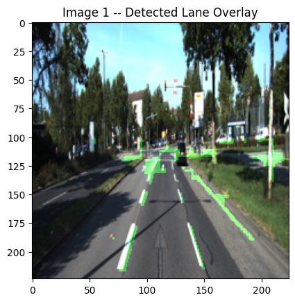
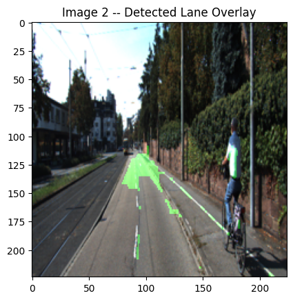

# Lane Detection with Image Processing

Detecting lane markings in real road images **without machine learning**, using a hand-built image processing pipeline in Python and OpenCV. The pipeline was tested on 
images from the [KITTI road dataset](https://www.cvlibs.net/datasets/kitti/eval_road.php), used in autonomous driving research.

Final project for Image Processing & Computer Vision, MSU Denver, Spring 2026.

## Results

<!-- Upload your final green overlay images to the repo, then update the file names below -->
| Clear road | Road with a cyclist |
|---|---|
|  |  |

The pipeline highlights the lane markings in green on both scenes. It also has a known false positive: **sidewalks and curbs get detected as lanes.** Light-colored concrete is much brighter than asphalt, so it passes the brightness threshold just like lane paint, and because it sits in the lower part of the image, the region-of-interest mask doesn't remove it. The clear-road image also picks up some noise near the horizon from bright road signs.

## How it works

| Step | Technique | Why |
|---|---|---|
| 1 | **Average filter** (10×10) | Smooths out asphalt texture so edge detection isn't overwhelmed by noise |
| 2 | **Sobel edge detection** | Finds edges; the vertical kernel responds strongly to lane lines, which run mostly top-to-bottom |
| 3 | **Brightness thresholding** | Lane paint is much brighter than asphalt, so pixels well above the image's mean brightness are likely lane pixels |
| 4 | **Region-of-interest mask** | Removes the upper part of the image (sky, trees, buildings) where lanes never appear |
| 5 | **Morphological open/close** | Opening (2×2) removes small noise blobs; closing (8×8) fills gaps in the lane regions |
| 6 | **Contours + convex hulls** | Outlines each detected lane region |
| 7 | **Hough line transform** | Fits straight lines to the lane markings |
| 8 | **Overlay** | Blends the final lane mask onto the original image in green |

### Tuning notes

- **Kernel size mattered a lot.** A 5×5 opening kernel erased the thin lane lines entirely, so I reduced it to 2×2. Closing was tuned to 8×8 so it fills gaps without merging unrelated regions.
- **Hough threshold = 50** gave the best balance between catching real lane lines and avoiding false detections.

## Limitations & future work

- **Sidewalks are misdetected as lanes.** Brightness alone can't tell white lane paint from light concrete.
- The Hough transform still picks up extra lines from other bright objects, which is a common limitation of classical methods on real-world images.
- **Next steps:**
  - Use HSV color thresholding to separate white and yellow lane paint from other bright objects.
  - Use a trapezoid-shaped mask that follows the road's perspective, cutting out the sidewalks along the edges.
  - Process video frames for real-time tracking.
  - Compare the results against a machine learning approach.

## Tools & Libraries

Python · OpenCV · NumPy · Google Colab

## Run it yourself

1. Click the **Open in Colab** badge above.
2. Upload `laneImage1.png` and `laneImage2.png` to the Colab session.
3. Change the two `cv.imread(...)` paths in the first cell to `'laneImage1.png'` and `'laneImage2.png'`, then click **Runtime → Run all**.

## Attribution

The filtering, edge detection, thresholding, masking, morphology, contour, and Hough steps were adapted from my course homework and class demos. The final overlay visualization and small parts of the ROI mask and contour code were written with AI assistance. These sections are labeled in the notebook.
